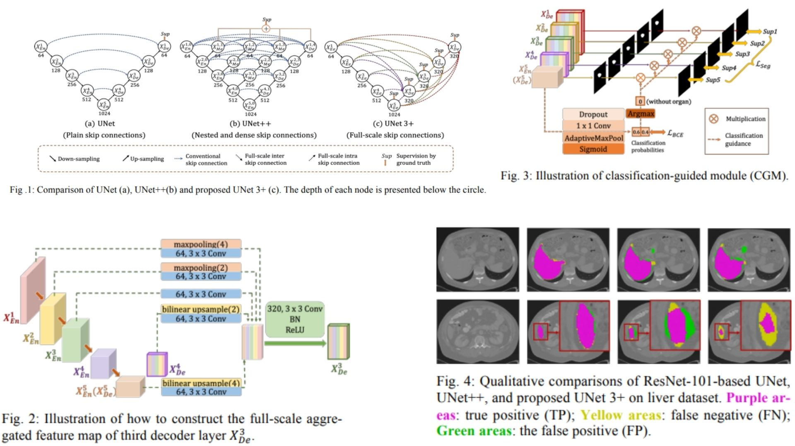

# ➕ UNet3Plus-Replication — Full-Scale Medical Image Segmentation

This repository provides a **faithful Python replication** of the **UNet 3+ framework** for medical image segmentation.  
It implements the pipeline described in the original paper, including **full-scale skip connections, and multi-scale deep supervision.**

Paper reference: *[UNet 3+: A Full-Scale Connected UNet for Medical Image Segmentation](https://arxiv.org/abs/2004.08790)*  

---

## Overview 🌌



> UNet 3+ enhances standard U-Net by connecting **all encoder and decoder stages** at each decoding layer, allowing rich **multi-scale feature fusion** and improved segmentation accuracy.

Key points:

* **Encoder** extracts hierarchical features $$E_i$$ via downsampling  
* **Decoder** performs **full-scale fusion** at each stage $$D_j = F(E_1,...,E_5,D_{j+1}...)$$  
* **Deep supervision** produces intermediate predictions $$\hat{Y}_j$$ from each decoder stage  
* **Final output** consists of multi-scale segmentation maps ready for loss computation  

---

## Core Math 🧮

**Full-Scale Fusion at decoder stage $j$**:

$$
D_j = \text{Conv}_{1\times1} \Big( \text{Concat}(\text{Resize}(E_1,...,E_5, D_{>j})) \Big)
$$

**Deep supervision loss**:

$$
\mathcal{L}_{total} = \sum_{j} \lambda_j \mathcal{L}(\hat{Y}_j, Y)
$$

**Dice + BCE Loss**:

$$
\mathcal{L} = \mathcal{L}_{Dice} + \mathcal{L}_{BCE}, \quad
Dice = \frac{2 \sum_i p_i g_i + \epsilon}{\sum_i p_i + \sum_i g_i + \epsilon}
$$

Where $$p_i$$ is predicted probability, $$g_i$$ ground truth, and $$\epsilon$$ a smoothing factor.

---

## Why UNet 3+ Matters 💫

* Connects **all encoder-decoder features**, capturing rich **multi-scale context**  
* Uses **deep supervision** to stabilize training across resolutions  
* Achieves **state-of-the-art accuracy** in medical image segmentation  

---

## Repository Structure 🏛️

```bash
UNet3Plus-Replication/
├── src/
│   ├── encoder/
│   │   ├── e_blocks.py               # Encoder conv blocks + downsampling
│   │   └── encoder.py                 # Forward pass producing E1–E5
│   │
│   ├── decoder/
│   │   ├── d_blocks.py               # Decoder conv blocks + upsampling
│   │   └── decoder.py                 # D1–D4 via full-scale fusion
│   │
│   ├── aggregation/
│   │   └── full_scale_fusion.py      # Multi-scale fusion logic
│   │
│   ├── supervision/
│   │   └── deep_supervision.py       # Multi-output heads
│   │
│   ├── loss/
│   │   └── segmentation_loss.py      # Dice + BCE
│   │
│   ├── model/
│   │   └── unet3plus.py              # Full model orchestration
│   │
│   └── config.py                     # base_channel, learning_rate, num_classes, device
│
├── images/
│   └── figmix.jpg                   
│
├── requirements.txt
└── README.md
```

---

## 🔗 Feedback

For questions or feedback, contact:  
[barkin.adiguzel@gmail.com](mailto:barkin.adiguzel@gmail.com)
